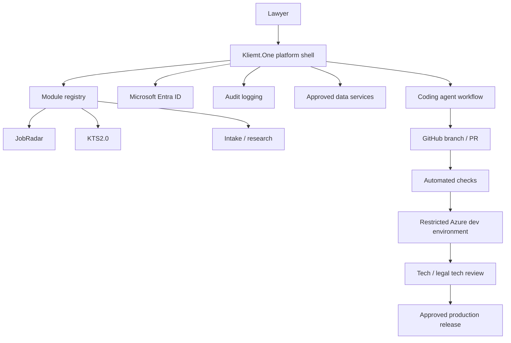

# Initial Platform Architecture

## Recommended first technical step

The next small step should be to create the repository foundation and a minimal platform shell before provisioning cloud resources. Azure resources should be created from infrastructure-as-code after the shell and governance rules are visible in the repository.

## Proposed baseline

## Hosting direction

Use Azure Container Apps as the initial hosting target for the platform shell and small APIs because it supports containerized applications without requiring Kubernetes operations at the start.

Recommended early Azure resources:

- Azure Container Apps environment for development.
- Azure Container Registry or GitHub Container Registry for images.
- Managed identity for service-to-service access.
- Azure Key Vault for secrets.
- Application Insights / Log Analytics for observability.
- Microsoft Entra ID for authentication.

## Integration model

Existing tools should not be merged blindly. Each integration should define:

- owner and maintainers,
- user roles,
- data inputs and outputs,
- persistence needs,
- whether data includes client, employee, or special-category data,
- API contract,
- audit and retention needs,
- test and rollback plan.

## Agent-native workflow

Coding agents may create prototypes, but they should operate within these constraints:

- work on branches and pull requests,
- include documentation and tests for changes,
- avoid direct production deployment,
- use repository templates and ADRs for architectural choices,
- keep sensitive data out of code and test fixtures,
- make small changes that a reviewer can understand.

## Why Azure resources are not step one

Provisioning Azure first can create infrastructure before the product contract is clear. The better sequence is:

1. document the platform rules,
2. build the smallest shell,
3. define infrastructure-as-code,
4. create a restricted dev deployment,
5. integrate the first narrow workflow.
